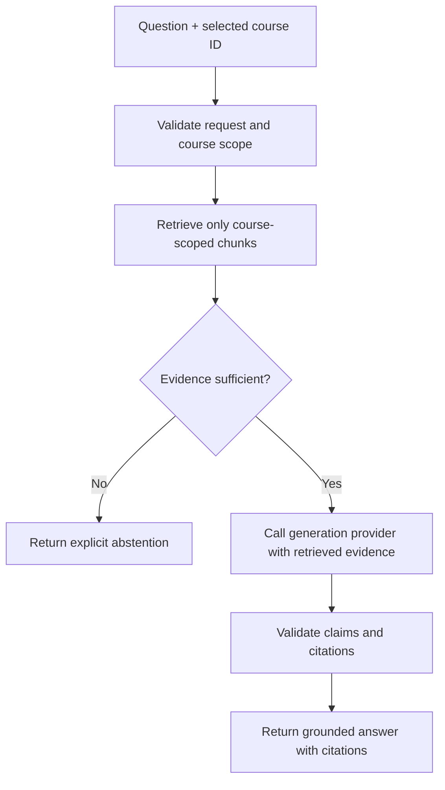
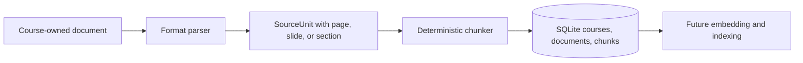

# CourseRAG architecture

## Scope and status

Milestone 1-A implements local document parsing, page-aware chunking, and SQLite
metadata persistence behind a developer CLI. The FastAPI surface remains the
Milestone 0 `/health` endpoint, and the Next.js page remains static. Components
labelled **planned** do not exist yet.

## Primary invariant

For course-content questions, generation is downstream of successful retrieval
and evidence validation. The application must not call a generation provider
when the selected course does not yield sufficient evidence.

The `No` branch ends before provider invocation. A prompt asking a model to
abstain is a useful secondary control, but it cannot replace this backend branch.

The implemented ingestion path is separate from that future answer path:

## Major components

### Web application

The Next.js frontend will present course selection, document-management status,
questions, answers, citations, and abstention states. It will communicate with
the backend through typed HTTP contracts. It remains a static page in Milestone
1-A and does not call the API.

### API and orchestration

The FastAPI backend owns request validation and the answer workflow. Planned
orchestration responsibilities are course authorization, retrieval, evidence
gating, provider invocation, citation validation, and stable response shapes.
The only current endpoint is `GET /health`.

### Ingestion pipeline

The implemented ingestion pipeline:

1. requires one existing course ID and a supported local file;
2. validates existence, extension, non-empty size, and configured size limit;
3. extracts page, slide, or honest section units from PDF, PPTX, DOCX,
   Markdown, or text;
4. creates overlapping chunks carrying course, document, and source ranges;
5. writes document metadata and chunks in one SQLite transaction; and
6. returns the existing document when the same checksum already belongs to the
   same course.

No embeddings or vectors are produced. Uploaded documents remain untrusted
input; the current CLI applies file-size and type limits and returns explicit
errors. A production upload boundary is planned separately.

### Metadata store

SQLite stores courses, documents, chunk text, checksums, and source locators.
Foreign keys link documents to courses and use `(document_id, course_id)` for
chunks, preventing a chunk from claiming a different course than its document.
Course-scoped indexes support later retrieval. Database files live under
`runtime/` and are ignored by Git.

### Vector store (planned)

Qdrant will store embeddings and retrieval payloads. Every vector must carry an
immutable course identifier and document/chunk provenance. Retrieval must apply
the selected course as a storage-level filter, and backend code must verify the
course identifier of every returned item before evidence gating.

### Provider boundaries (planned)

Small interfaces will separate orchestration from:

- embedding providers, which convert validated chunks or queries to vectors;
- generation providers, which receive only a question, approved evidence, and
  grounding instructions.

OpenAI is planned as an initial implementation. Provider configuration and
credentials will come from environment variables; credentials must never be
stored in code, prompts, logs, fixtures, or Git.

### Evidence gate and citation validator (planned)

The evidence gate will decide whether retrieved passages are adequate for the
question using explicit, testable rules. The exact scoring policy belongs to a
later milestone. Its contract must produce a structured sufficient/insufficient
decision and explanatory reason.

After generation, a citation validator will reject or downgrade unsupported
claims, verify that cited chunk IDs were in the approved evidence set, and
return locators suitable for the source format.

## Course isolation

Course isolation is a correctness and privacy boundary, not a ranking hint.
Current and future defenses are layered:

1. every persisted document and chunk is assigned one course ID at ingestion;
2. SQLite composite foreign keys prevent document/chunk course mismatches;
3. the storage interface exposes chunk listing only with an explicit course ID;
4. automated tests prove two courses remain distinct;
5. future vector retrieval must apply an exact course filter; and
6. future answer orchestration must reject mismatched results before prompting.

Documents or chunks from Course A must never appear in retrieval, prompts,
answers, or citations for Course B.

## Runtime and trust boundaries

- Browser requests, uploaded files, extracted text, retrieved chunks, provider
  responses, and model output are untrusted at their respective boundaries.
- The backend is the policy enforcement point for course scope and generation
  eligibility.
- Runtime data belongs under `runtime/` and remains local by default.
- The frontend must not receive provider credentials.
- Errors must be explicit and observable; failed parsing, retrieval, or provider
  calls must not be converted into fabricated answers.

## Intended request outcome types

The future answer API should return a stable discriminated outcome:

- `answered`: grounded answer plus validated citations;
- `insufficient_evidence`: explicit abstention without a generation call; or
- `error`: an operational failure, distinct from lack of evidence.

The precise endpoint and schema will be designed in the milestone that
implements the answer path.
