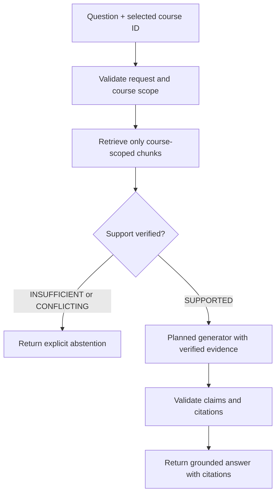
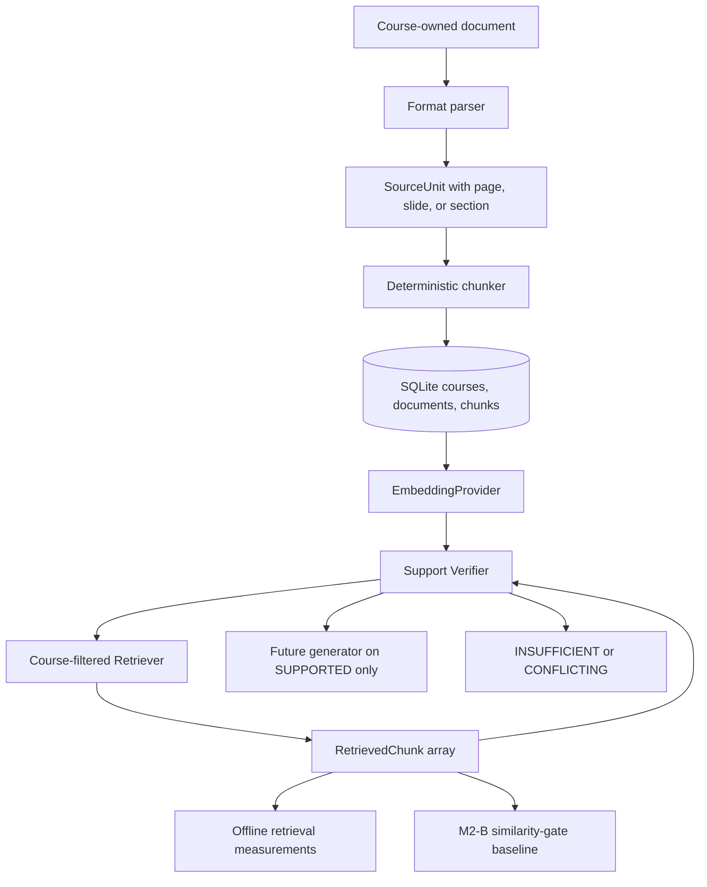

# CourseRAG architecture

## Scope and status

Milestone 3-A implements local document parsing and persistence, embedding,
Qdrant indexing, course-scoped retrieval, offline retrieval evaluation, the
M2-B similarity baseline, and support verification behind developer CLI
commands. The FastAPI surface remains the Milestone 0 `/health` endpoint, and
the Next.js page remains static. Components labelled **planned** do not exist
yet.

## Primary invariant

For course-content questions, generation is downstream of successful retrieval
and evidence validation. The application must not call a generation provider
when the selected course does not yield sufficient evidence.

The non-supported branch ends before any future generation-provider invocation.
A prompt asking a model to abstain is a useful secondary control, but it cannot
replace this backend branch.

The implemented path stops at structured retrieval results:

## Major components

### Web application

The Next.js frontend will present course selection, document-management status,
questions, answers, citations, and abstention states. It will communicate with
the backend through typed HTTP contracts. It remains static in Milestone 2-B.

### API and orchestration

The FastAPI backend owns request validation and the answer workflow. Planned
orchestration responsibilities are course authorization, retrieval, evidence
gating, provider invocation, citation validation, and stable response shapes.
The only current endpoint is `GET /health`.

### Ingestion pipeline

The implemented ingestion pipeline:

1. requires one existing course ID and a supported local file;
2. validates existence, extension, non-empty size, and configured size limit;
3. extracts page, slide, or honest section units from PDF, PPTX, DOCX,
   Markdown, or text;
4. creates overlapping chunks carrying course, document, and source ranges;
5. writes document metadata and chunks in one SQLite transaction; and
6. returns the existing document when the same checksum already belongs to the
   same course.

Ingestion remains separate from indexing so embedding-provider failures do not
affect document persistence. Uploaded documents remain untrusted input; the CLI
applies file-size and type limits and returns explicit errors.

### Metadata store

SQLite stores courses, documents, chunk text, checksums, and source locators.
Foreign keys link documents to courses and use `(document_id, course_id)` for
chunks, preventing a chunk from claiming a different course than its document.
Course-scoped indexes support later retrieval. Database files live under
`runtime/` and are ignored by Git.

### Embedding and vector index

Qdrant stores vectors and compact provenance payloads; authoritative chunk text
remains in SQLite. Stable chunk UUIDs are Qdrant point IDs. One collection is
derived from provider, model, dimension, and a configured prefix. Collection
metadata is checked before use, so incompatible embeddings cannot mix.

Every Qdrant query requires a course ID and applies it inside `query_points` as
an exact payload filter. Returned payloads are then checked against SQLite;
missing or contradictory provenance is an explicit consistency error.

### Provider boundary

The implemented `EmbeddingProvider` interface exposes provider/model identity,
dimension, batch document embedding, and query embedding. The deterministic
provider supports offline tests; OpenAI is the external embedding option.

Generation providers remain planned. Credentials come from environment
variables and are never stored in vectors, logs, fixtures, or Git.

### Retrieval evaluation

The evaluation runner creates temporary SQLite and in-memory Qdrant stores,
reuses the production ingestion, indexing, and retrieval path, and reports
Hit@k, Recall@k, raw scores, and course-isolation status. It makes no evidence
sufficiency decision. The checked-in corpus and labels are synthetic and
human-readable; optional JSON output belongs under ignored runtime storage.

### Similarity baseline, support verifier (implemented), and citation validator (planned)

The M2-B Evidence Gate remains an evaluated provider-bound top-1 similarity
baseline. Its strict threshold gave zero answerable holdout coverage on the
current synthetic corpus, so it is not a mandatory prerequisite for M3-A.

The Support Verifier receives only the selected question and already
course-scoped `RetrievedChunk` values. It classifies the evidence as
`SUPPORTED`, `INSUFFICIENT`, or `CONFLICTING`; the backend validates all bound
chunk IDs against the retrieved set and SQLite provenance before preserving a
decision. It neither generates an answer nor decides factual truth beyond
whether the supplied evidence can support answering the question.

After future generation, a citation validator will reject or downgrade unsupported
claims, verify that cited chunk IDs were in the approved evidence set, and
return locators suitable for the source format.

## Grounding layers

1. **Course-isolated retrieval — implemented.** Qdrant filters before results
   are hydrated and SQLite revalidates provenance.
2. **Similarity-gate baseline — implemented, experimentally too conservative
   on the current holdout.** It remains available for comparison.
3. **Evidence Support Verifier — implemented.** It fails closed unless a
   structured decision binds valid retrieved evidence.
4. **Answer generator constrained to verified evidence — not implemented.**
5. **Claim/citation validation — not implemented.**

## Course isolation

Course isolation is a correctness and privacy boundary, not a ranking hint.
Current and future defenses are layered:

1. every persisted document and chunk is assigned one course ID at ingestion;
2. SQLite composite foreign keys prevent document/chunk course mismatches;
3. the storage interface exposes chunk listing only with an explicit course ID;
4. automated tests prove two courses remain distinct;
5. Qdrant retrieval applies an exact `course_id` filter before returning hits;
6. backend retrieval verifies Qdrant provenance against SQLite; and
7. future answer orchestration must reject mismatched evidence before prompting.

Documents or chunks from Course A must never appear in retrieval, prompts,
answers, or citations for Course B.

## Runtime and trust boundaries

- Browser requests, uploaded files, extracted text, retrieved chunks, provider
  responses, and model output are untrusted at their respective boundaries.
- The backend is the policy enforcement point for course scope and generation
  eligibility.
- Runtime data belongs under `runtime/` and remains local by default.
- The frontend must not receive provider credentials.
- Errors must be explicit and observable; failed parsing, retrieval, or provider
  calls must not be converted into fabricated answers.

## Intended request outcome types

The future answer API should return a stable discriminated outcome:

- `answered`: grounded answer plus validated citations;
- `insufficient_evidence`: explicit abstention without a generation call; or
- `error`: an operational failure, distinct from lack of evidence.

The precise endpoint and schema will be designed in the milestone that
implements the answer path.
