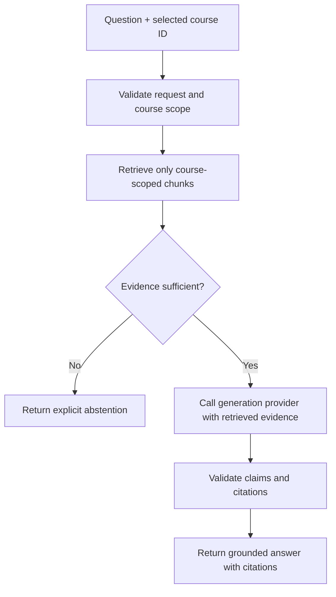

# CourseRAG architecture

## Scope and status

This document describes the intended architecture. Milestone 0 implements only
the repository scaffold, a FastAPI `/health` endpoint, a static Next.js page,
and their supporting tests and CI. Components labelled **planned** do not exist
yet.

## Primary invariant

For course-content questions, generation is downstream of successful retrieval
and evidence validation. The application must not call a generation provider
when the selected course does not yield sufficient evidence.

The `No` branch ends before provider invocation. A prompt asking a model to
abstain is a useful secondary control, but it cannot replace this backend branch.

## Major components

### Web application

The Next.js frontend will present course selection, document-management status,
questions, answers, citations, and abstention states. It will communicate with
the backend through typed HTTP contracts. In Milestone 0 it is a static page and
does not call the API.

### API and orchestration

The FastAPI backend owns request validation and the answer workflow. Planned
orchestration responsibilities are course authorization, retrieval, evidence
gating, provider invocation, citation validation, and stable response shapes.
The only current endpoint is `GET /health`.

### Ingestion pipeline (planned)

The ingestion pipeline will:

1. accept a document associated with one explicit course;
2. validate file type and operational limits;
3. extract text and location metadata from PDF, PPTX, DOCX, Markdown, or text;
4. create traceable chunks carrying course, document, and source-location IDs;
5. request embeddings through an embedding-provider interface; and
6. write metadata and vectors only after validating their course scope.

Uploaded documents are untrusted input. Parsers will require file-size and type
limits, bounded work, clear errors, and isolation from application secrets.

### Metadata store (planned)

SQLite will hold application metadata such as courses, documents, ingestion
state, chunk provenance, and source locators. It will not be used in Milestone 0.
Database files live under `runtime/` and are ignored by Git.

### Vector store (planned)

Qdrant will store embeddings and retrieval payloads. Every vector must carry an
immutable course identifier and document/chunk provenance. Retrieval must apply
the selected course as a storage-level filter, and backend code must verify the
course identifier of every returned item before evidence gating.

### Provider boundaries (planned)

Small interfaces will separate orchestration from:

- embedding providers, which convert validated chunks or queries to vectors;
- generation providers, which receive only a question, approved evidence, and
  grounding instructions.

OpenAI is planned as an initial implementation. Provider configuration and
credentials will come from environment variables; credentials must never be
stored in code, prompts, logs, fixtures, or Git.

### Evidence gate and citation validator (planned)

The evidence gate will decide whether retrieved passages are adequate for the
question using explicit, testable rules. The exact scoring policy belongs to a
later milestone. Its contract must produce a structured sufficient/insufficient
decision and explanatory reason.

After generation, a citation validator will reject or downgrade unsupported
claims, verify that cited chunk IDs were in the approved evidence set, and
return locators suitable for the source format.

## Course isolation

Course isolation is a correctness and privacy boundary, not a ranking hint.
Planned defenses are layered:

1. every document, chunk, and vector is assigned one course ID at ingestion;
2. every query requires one selected course ID;
3. vector retrieval applies an exact course filter;
4. backend orchestration rejects results whose course ID does not match;
5. only the validated result set can reach the evidence gate or model; and
6. automated tests will attempt cross-course retrieval and fail closed.

Documents or chunks from Course A must never appear in retrieval, prompts,
answers, or citations for Course B.

## Runtime and trust boundaries

- Browser requests, uploaded files, extracted text, retrieved chunks, provider
  responses, and model output are untrusted at their respective boundaries.
- The backend is the policy enforcement point for course scope and generation
  eligibility.
- Runtime data belongs under `runtime/` and remains local by default.
- The frontend must not receive provider credentials.
- Errors must be explicit and observable; failed parsing, retrieval, or provider
  calls must not be converted into fabricated answers.

## Intended request outcome types

The future answer API should return a stable discriminated outcome:

- `answered`: grounded answer plus validated citations;
- `insufficient_evidence`: explicit abstention without a generation call; or
- `error`: an operational failure, distinct from lack of evidence.

The precise endpoint and schema will be designed in the milestone that
implements the answer path.
